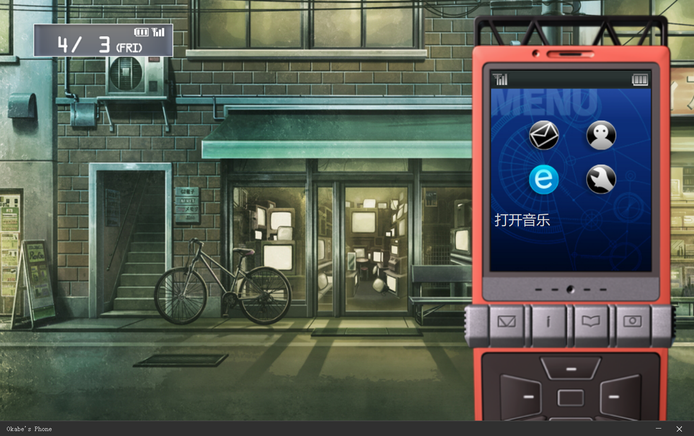
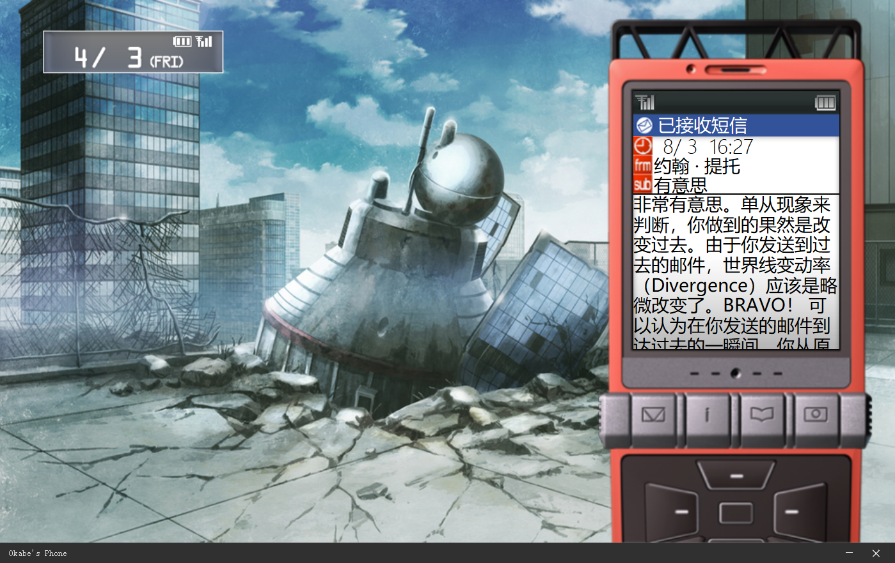
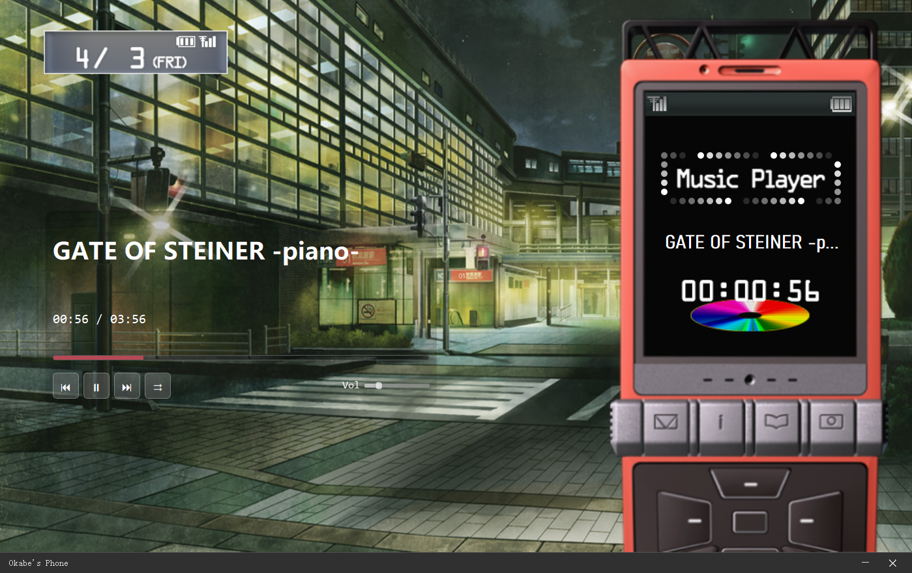

# Okabe's Phone
仅提供可执行版本的压缩包下载。 
这是一个基于《命运石之门》本篇画面改造而成的本地音乐播放器。程序在游戏中冈部伦太郎的手机里额外加入了音乐播放功能。

[点击下载最新版本](https://github.com/ShikiMizuhara/Okabe-s-Phone/releases/latest/download/Okabe-s-Phone.rar)

## 主要功能

- 原版游戏界面：主界面沿用《命运石之门》本篇中的手机画面与布局。 

   
  
- 手机模拟交互：
  - 点击左上角日期按钮可唤出冈部伦太郎的手机主菜单。
  - 鼠标左键单击充当“前进”或“确认”功能。
  - 鼠标右键单击充当“返回”功能。
- 音乐播放：左下角原本不可点击的浏览器图标已被替换为音乐播放功能入口。
- 播放控制：双击歌曲开始播放，左侧控制面板提供以下功能：
  - 上一曲 / 播放暂停 / 下一曲
  - 播放模式切换（顺序播放 / 单曲循环）
  - 音量调节
  - 可点击的进度条
- 自定义设置：
  - 在设置中指定本地音乐文件夹路径。
  - 更换手机壁纸，内置许多游戏原版壁纸，也支持自定义图片（推荐使用 1400×850 分辨率以获得最佳显示效果）。
- 短信收藏：信箱内收录了 Chapter 10 中冈部伦太郎手机里的所有短信（可能不完整），暂未包含附件。 

   

## 使用方法

- 从右侧 Releases 页面下载最新版本的可执行文件。
- 解压后运行程序，进入主界面。
- 点击左上角日期按钮，唤出手机菜单。
- 进入“进行各种设定”，设置您的音乐文件夹路径。
- 返回主界面，点击左下角浏览器图标进入播放器。
- 双击歌曲开始播放，并通过左侧面板进行控制。
- 注意：返回主界面时，音乐播放会自动暂停并关闭。

## 注意事项

- 音乐列表不支持分类、折叠或排序功能，仅按读取顺序排列。如果音乐文件数量极多，暂不清楚可能出现的问题。
- 歌曲名称优先读取音频元数据，若读取失败或检测到乱码，将回退显示文件名。但仍有可能遇到编码问题导致的异常显示。
- 自定义壁纸推荐使用 1400×850 分辨率，其他尺寸可能比例失调。
- 软件功能较为基础，仅供欣赏和轻量级本地音乐播放需求。 

   

## 结语

欢迎加入三百人委员会。本项目无任何商业用途。
